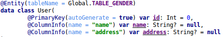
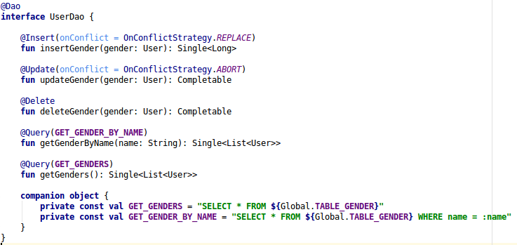
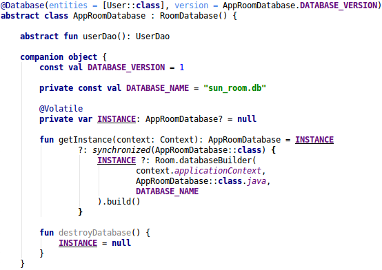

# Sqlite-Room

## Sqlite
- Là một CSDL mã nguồn mở, được tích hợp sẵn trên thiết bị Android. Không cần phải thiết lập bất cứ kết nối nào để truy vấn dữ liệu.
- SQLite có các ưu điểm sau:
	+ Độ tin cậy cao: các hoạt động transaction nội trong CSDL được thực hiện trọn vẹn, không gây lỗi khi xảy ra sự cố phần cứng.
	+ Không cần cài đặt cấu hình
	+ Kích thước gọn nhẹ, thao tác đơn giản, nhanh hơn các hệ thống CSDL khách/chủ
	+ Không cần phần mềm phụ trợ.

## Room
- Room là một phần trong Android Architecture Components được giới thiệu trong Google I/O 2016.
- Room là một thư viện lưu trữ dữ liệu lâu dài cung cấp một lớp trừu tượng trên SQLite để cho phép truy cập CSDL mạnh mẽ hơn trong khi khai thác toàn bộ sức mạnh của SQLite.
- Room có 3 thành phần chính:

	+ Database: Được chú thích bởi annotated @Database, là một đối tượng giữ kết nối với SQLite DB và tất cả các hoạt động được thực hiện thông qua nó.
	+ Entity: Đại diện cho 1 bảng trong database. Chú thích bằng annotated @Entity
	+ DAO: Là một Interface chứa các phương thức để truy cập vào database. Được chú thích bằng @Dao

### Lợi thế của Room
- Kiểm tra @Query và @Entity ở compile-time, ngoài kiểm tra cú pháp nó còn kiểm tra được các trường hợp khác như thiếu bảng.
- Code soạn sẵn ít
- Tích hợp đầy đủ với các thành phần khác trong Architecture components (như LiveData)

### How do use it
- Ví dụ: chúng ta xây dựng ứng dụng để lưu trữ thông tin User
- Đầu tiên, ta thêm thư viện Room.

#### Entities
- Được chú thích bằng annotation *@Entity*. Việc thiết kế bảng với các cột trở nên dễ dàng.
- User.kt: Giới tính của trainee
	

	+ annotation *@PrimaryKey(autoGenerate = true)*: chỉ ra đây là khóa chính và sẽ tự động tăng.
	+ Mặc định, Room sử dụng tên các trường làm tên cột, nếu muốn đặt tên cột khác ta sử dụng annotation *@ColumnInfo*
	+ Khi class được chú thích là @Entity thì tên của bảng sẽ là tên của class, nếu muốn đặt tên bảng khác ta có thể thêm thuộc tính *tableName* trong @Entity

#### DAOs (Data Access Object)
- Sử dụng để truy cập dữ liệu. Mỗi *DAO* bao gồm tập hợp các phương thức để thao tác với dữ liệu. Được chú thích bằng anotation *@Dao*
- Một *DAO* có thể được thể hiện như một *interface* hoặc *abstract*
- UserDao.kt
		
	
	+ Các hàm được chú thích bởi *@Insert*, *@Update*, *@Delete* nhận một instance của lớp cần thiết làm tham số, đại diện cho đối tượng mà chúng ta muốn muốn insert, update hoặc delete.
	+ Trong trường hợp *insert* or *update*, có thể sử dụng thuộc tính *onConflict* để cho biết phải làm gì khi xảy ra xung đột khi thực hiện thao tác. Các chiến lược có thể sử dụng như: REPLACE, ABORT, FAIL, IGNORE, ROLLBACK
	+ *@Query*: Lấy thông tin của một hoặc nhiều Entity.

#### Database
- Giữ một kết nối đến SQLite DB.

	

	+ Được chú thích bởi @Database. Là một abstract class kế thừa từ RoomDatabase. Nó nhận vào một danh sách các thực thể với tất cả các lớp tạo CSDL (tất cả các lớp có chú thích @Entity)
	+ Chúng ta phải khai báo một hàm abstract cho mỗi Entity, hàm này phải trả về giá trị tương ứng DAO (Lớp được chú thích là @Dao)

### Migration với Room
- Với Room, nếu bạn thay đổi lược đồ CSDL nhưng không nâng cấp version, ứng dụng sẽ bị crash. Nếu bạn nâng cấp version nhưng không cung cấp bất cứ *migration* thì app sẽ bị crash hoặc các bảng CSDL sẽ bị hủy và mất dữ liệu người dùng.
- Room cho phép chúng ta viết lớp *Migration* để bảo vệ dữ liệu người dùng
- Room cung cấp một lớp trừu tượng *Migration* để dễ dàng chuyển đổi SQLite. Lớp *Migration* định nghĩa các hành động cần được thực hiện khi chuyển đổi từ version cũ sang version mới.

- Những gì xảy ra khi truy cập vào CSDL lần đầu tiên:
	+ Room được tạo
	+ SQLiteOpenHelper.onUpgrade() được gọi và Room kích hoạt *migration*
	+ Database được mở

#### Chuyển đổi SQLite API code sang Room
- Giữ nguyên database version -> App crashes
	+ Room sẽ check định danh của CSDL bằng cách so sánh *identity hash* của version hiện tại với version được lưu trong *room_master_table*. Nhưng vì không có *identity hash* nào được lưu dẫn đến crash (IllegalStateException).
- Tăng version nhưng không cung cấp *migration* -> App crashes
	+ Khi chạy lại app, Room sẽ làm như sau: Thử nâng cấp version, nhưng vì không có *migration*, app bị crash với *IllegalStateException*
- Tăng version, Enable fallbackToDestructiveMigration() -> database bị xóa.
	+ Room thử nâng cấp version, bảng bị xóa và *identity_hash* được chèn.
	+ Room mở CSDL: *identity_hash* của version hiện tại và version được lưu là giống nhau.
- Tăng version, cung cấp *Migration* -> Dữ liệu được toàn vẹn.
	+ Room nâng cấp version: kích hoạt *migration* và cập nhật *identity hash* trong room_master_table
	+ Room mở database
	+ Nếu lược đồ CSDL không thay đổi, chỉ cần cung cấp một *empty migration* để Room sử dụng.

#### Migration với các thay đổi lược đồ đơn giản.
- Ví dụ: Thêm 1 trường vào bảng User. Trong Database cần làm những công việc sau:
	+ Tăng version 2
	+ Add 1 Migration từ version 1 lên 2
	+ Add *Migration* vào Room database builder
- Khi 

## Tài liệu tham khảo
- SQLite:
- Room:
	+ https://developer.android.com/training/data-storage/room/index.html
	+ https://medium.com/mindorks/room-kotlin-android-architecture-components-71cad5a1bb35
	+ Google Sample: https://github.com/googlesamples/android-architecture-components
	+ Room + Rx: https://medium.com/androiddevelopers/room-rxjava-acb0cd4f3757
	+ SQLite to Room: https://medium.com/androiddevelopers/7-steps-to-room-27a5fe5f99b2
