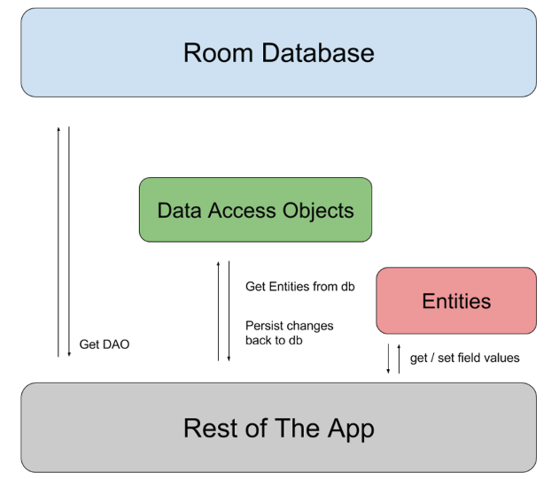
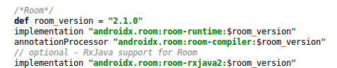
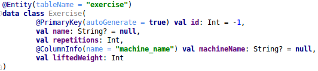
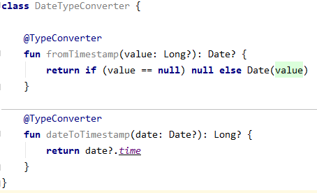

# Sqlite-Room

## Sqlite
- Là một CSDL mã nguồn mở, được tích hợp sẵn trên thiết bị Android. Không cần phải thiết lập bất cứ kết nối nào để truy vấn dữ liệu.
- SQLite có các ưu điểm sau:
	+ Độ tin cậy cao: các hoạt động transaction nội trong CSDL được thực hiện trọn vẹn, không gây lỗi khi xảy ra sự cố phần cứng.
	+ Không cần cài đặt cấu hình
	+ Kích thước gọn nhẹ, thao tác đơn giản, nhanh hơn các hệ thống CSDL khách/chủ
	+ Không cần phần mềm phụ trợ.

## Room
- Room là một thư viện lưu trữ dữ liệu lâu dài cung cấp một lớp trừu tượng trên SQLite để cho phép truy cập CSDL mạnh mẽ hơn trong khi khai thác toàn bộ sức mạnh của SQLite.
- Room có 3 thành phần chính:

	+ Database: Được chú thích bởi annotated @Database, là một đối tượng giữ kết nối với SQLite DB và tất cả các hoạt động được thực hiện thông qua nó.
	+ Entity: Đại diện cho 1 bảng trong database. Chú thích bằng annotated @Entity
	+ DAO: Là một Interface chứa các phương thức để truy cập vào database. Được chú thích bằng @Dao

### Ví dụ
- Trong ví dụ này, chúng ta xây dựng ứng dụng để lưu trữ thói quen tập thể dục của bạn
- Đầu tiên, ta thêm thư viện Room.

#### Entities
- Gender.kt: Giới tính của trainee
	

	+ annotation *@PrimaryKey(autoGenerate = true)*: chỉ ra đây là khóa chính và sẽ tự động tăng.
	+ Khi class được chú thích là @Entity thì tên của bảng sẽ là tên của class, nếu muốn đặt tên bảng khác ta có thể thêm thuộc tính *tableName* trong @Entity

- Exercise.kt: Đại diện cho một bài tập của *Routine*

	+ annotation *@ColumnInfo()*: Mặc định Room sẽ sử dụng các trường làm tên cột trong database. Nếu muốn đặt tên khác ta có thể sử dụng annotation này.

- Routine.kt: Tập các bài tập

	+ @TypeConverters: Sử dụng khi ta khai báo thuộc tính là kiểu lớp, list, date,...

- Trainee.kt: Chủ sở hữu của *Routine*

	+ *indices*: Sử dụng để lập chỉ mục các trường nhất định trong database để tăng tốc độ truy vấn.
	+ *foreignKeys*: Để chỉ ra mối quan hệ giữa 2 hay nhiều bảng, nó nhận được một mảng ForeignKey. Thuộc tính *entity* là tên của class cha, *parentColumns* là tên của cột ở lớp cha, *childColumns* tên của cột tại lớp được sử dụng.
	+ *@Embedded*: Sử dụng khi muốn đại diện cho một đối tượng mà nó được phân tách thành các trường con của nó trong một bảng.

#### DAOs
- Sử dụng để truy cập dữ liệu. Mỗi DAO bao gồm tập hợp các phương thức để thao tác với dữ liệu.
- GenderDao.kt
	
	
	+ Trong trường hợp *insert* or *update*, có thể sử dụng thuộc tính *onConflict* để cho biết phải làm gì khi xảy ra xung đột khi thực hiện thao tác. Các chiến lược có thể sử dụng như: REPLACE, ABORT, FAIL, IGNORE, ROLLBACK
	+ Nếu cú pháp câu lệnh SQL nó sẽ báo ở compile time.

#### Type Converters
- Được sử dụng khi chúng ta khai báo thuộc tính mà Room và SQL không thể tuần tự hóa.
- DateTypeConverter.kt:
	

#### Database
- Đại diện cho DB, nó giữ một kết nối đến SQLite DB.
	+ Là một abstract class kế thừa từ RoomDatabase. Được chú thích bởi @Database.
	+ Nó nhận được một danh sách các thực thể với tất cả các lớp tạo CSDL (tất cả các lớp có chú thích @Entity)
	+ Chúng ta phải khai báo một hàm abstract cho mỗi Entity, hàm này phải trả về giá trị tương ứng DAO (Lớp được chú thích là @Dao)

#### Sử dụng Room.

## Tài liệu tham khảo
- SQLite:
- Room:
	+ https://developer.android.com/training/data-storage/room/index.html
	+ https://medium.com/mindorks/room-kotlin-android-architecture-components-71cad5a1bb35
