# Sqlite-Room

## Sqlite
- Là một CSDL mã nguồn mở, được tích hợp sẵn trên thiết bị Android. Không cần phải thiết lập bất cứ kết nối nào để truy vấn dữ liệu.
- Truy cập vào CSDL SQLite liên quan đến việc truy cập vào hệ thống tệp tin, điều này có thể làm chậm. Vì vậy nó được khuyến khích để thực hiện các hoạt động cơ sở dữ liệu không đồng bộ.
- Mặc định CSDL được lưu trữ trong thư mục: *DATA/data/APP_NAME/databases/FILE_NAME*
- SQLite có các ưu điểm sau:
	+ Độ tin cậy cao: các hoạt động transaction nội trong CSDL được thực hiện trọn vẹn, không gây lỗi khi xảy ra sự cố phần cứng.
	+ Không cần cài đặt cấu hình
	+ Kích thước gọn nhẹ, thao tác đơn giản, nhanh hơn các hệ thống CSDL khách/chủ
	+ Không cần phần mềm phụ trợ.

### Sử dụng SQLite trong Android
- Ví dụ: Lưu trữ thông tin nhân viên của công ty gồm các thuộc tính: id, tên, địa chỉ, số điện thoại.

- Tạo class Employee:

	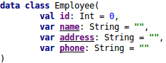

- Tạo class DatabaseHelper:
	+ Kế thừa class SQLiteOpenHelper (Đây là một class mà Android cho phép bạn xử lý các thao tác với database của SQLite)
	+ Sau đó cần override lại 2 phương thức: onCreate()-đây là nơi để bạn viết câu lệnh tạo bảng, nó được gọi duy nhất một lần, onUpgrade()-được gọi khi database được nâng cấp.

	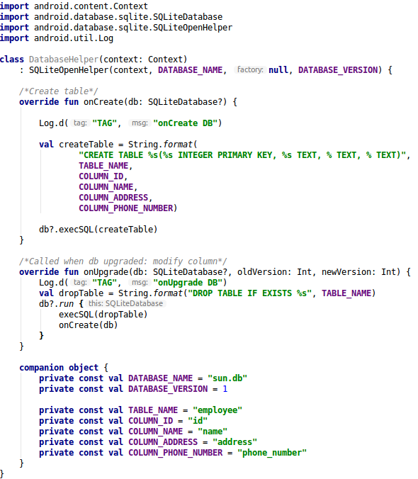

- Câu lệnh insert:
	+ Tạo phương thức tên là *insertEmployee* với tham số truyền vào là employee
	+ Đối tượng *ContentValues* được sử dụng để lưu các giá trị tương ứng với các trường trong bảng.
	+ Sử dụng hàm *insert* của SQLiteDatabase để thực hiện thêm mới.
	+ Giá trị trả về của câu lệnh là id của hàng mới được thêm vào hoặc -1 nếu xảy ra lỗi

	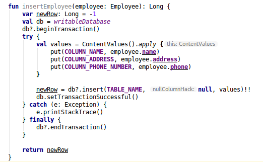

- Câu lệnh truy vấn dữ liệu trong bảng
	+ Tạo method *getAllEmployee* để lấy ra toàn bộ Employee trong CSDL
	+ Đối tượng *Cursor* được sử dụng để lưu giá trị trả về của truy vấn.
	
	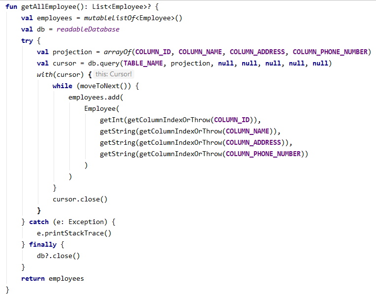

- Câu lệnh update:
	+ Tạo phương thức *updateEmployee* với tham số truyền vào là employee
	+ Hàm update của SQLiteDatabase được sử dụng để cập nhật dữ liệu trong bảng theo một điều kiện nào đó.
	+ Giá trị trả về của câu lệnh là số lượng hàng bị ảnh hưởng	

	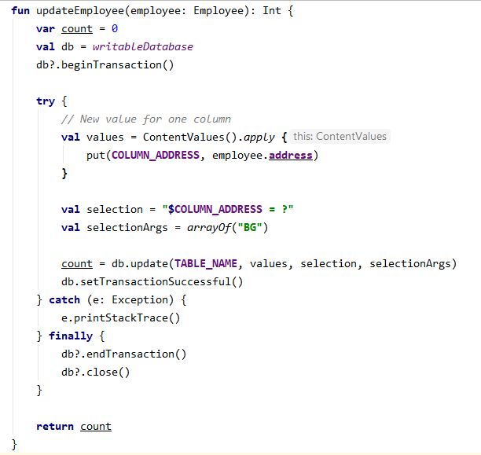

- Câu lệnh delete:
	+ Tạo phương thức *deleteEmployee* để xóa một hàng
	+ Hàm delete của SQLiteDatabase được sử dụng để xóa dữ liệu của một hoặc nhiều hàng trong bảng theo điều kiện nào đó.
	+ Giá trị trả về của câu lệnh là số lượng hàng bị ảnh hưởng

	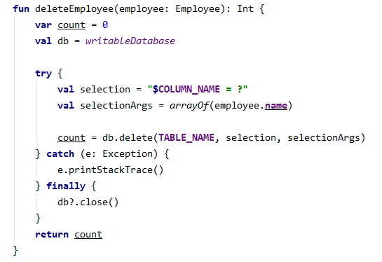

### Migration với SQLite
- Việc cập nhật database với các phiên bản có thể xảy ra các trường hợp sau:
	+ Khi cài đặt ứng dụng mà chưa có version 1 thì hàm onCreate() sẽ được gọi để tạo CSDL
	+ Khi cập nhật version thì hàm onUpgrade() sẽ được gọi
- Để cập nhật database lên version mới nhất là viết câu lệnh SQL và thực hiện câu lệnh trong hàm *onUpgrade()* để lấy dữ liệu cũ rồi cập nhật vào bảng mới.
- Việc cập nhật sẽ được thực hiện thủ công đối với từng version

### Transaction SQLite
- Là một tiến trình thực hiện một nhóm các câu lệnh SQL, các câu lệnh được thực thi một cách tuần tự và độc lập.
- Điều quan trọng là kiểm soát Transaction để đảm bảo tính toàn vẹn của dữ liệu và xử lý khi xảy ra lỗi.
- Các thuộc tính của Transaction: 4 thuộc tính viết tắt ACID
	+ Atomicity: Đảm bảo rằng tất cả các họat động trong đơn vị công việc được hoàn thành một cách thành công. Nếu không, transaction bị hủy bỏ tại thời điểm thất bại và các hoạt động trở về trạng thái cũ.
	+ Consistency: Đảm bảo CSDL thay đổi chính xác trạng thái khi transaction được commit thành công.
	+ Isolation: Các transaction hoạt động độc lập và không liên quan đến nhau.
	+ Durability: Đảm bảo rằng kết quả hoặc tác động của transaction đã commit vẫn tồn tại trong trường hợp lỗi hệ thống.
- Điều khiển transaction trong SQLite:
	+ BEGIN TRANSACTION: Bắt đầu 1 transaction
	+ COMMIT (END TRANSACTION): Lưu các thay đổi vào CSDL
	+ ROLLBACK: Hoàn tác các transaction chưa được lưu vào CSDL.

### Limit transaction
- Giới hạn số lượng insert có thể thực hiện trong 1 transaction là 10 triệu bản ghi.
### Cải thiện performance với SQLite
- Sử dụng transaction:

	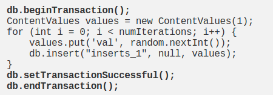

- Sử dụng db.execSQL():

	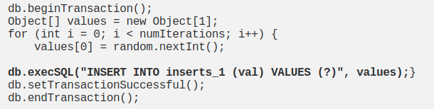

- Xem xét sử dụng lại SQLiteStatement trong khi chèn dữ liệu.

- Performance SQLite: https://medium.com/@JasonWyatt/squeezing-performance-from-sqlite-insertions-971aff98eef2

### Nhiều luồng cùng thực hiện truy vấn hoặc cùng thực hiện việc thay đổi database.
- SQLite cho phép nhiều luồng truy cập cùng một thời điểm, tuy nhiên chỉ có 1 tiến trình có thể thực hiện thay đổi CSDL. SQLite sử dụng cơ chế khóa toàn bộ CSDL (đồng bộ hóa) khi có 1 tiến trình đang thực hiện thao tác với database cho đến khi giao dịch đó thực hiện xong.
- Từ version 3.7.0, một option mới *Write Ahead Logging* cho phép việc đọc và viết có thể tiến hành đồng thời.
- SQLite hỗ trợ số lượng truy cập đọc dữ liệu đồng thời không giới hạn

## Room
- Room là một phần trong Android Architecture Components được giới thiệu trong Google I/O 2016.
- Room là Persistence Library cung cấp abstract layer cung cấp cách thức truy cập thao tác với dữ liệu trong CSDL SQLite.

- Lợi thế của Room
	+ Kiểm tra @Query và @Entity ở compile-time, ngoài kiểm tra cú pháp nó còn kiểm tra được các trường hợp khác như thiếu bảng.
	+ Không phải viết các câu lệnh dài để tạo database
	+ Ánh xạ các đối tượng CSDL sang đối tượng Java mà không cần phải viết code.
	+ Khi lược đồ CSDL thay đổi không phải cập nhật lại các câu truy vấn SQL thủ công.
	+ Tích hợp đầy đủ với các thành phần khác trong Architecture components (như LiveData, RxJava)

- Room có 3 thành phần chính:

	+ Database: Được chú thích bởi annotated @Database, là một đối tượng giữ kết nối với SQLite DB và tất cả các hoạt động được thực hiện thông qua nó.
	+ Entity: Đại diện cho 1 bảng trong database. Chú thích bằng annotated @Entity
	+ DAO: Là một lớp trừu tượng chứa các phương thức để truy cập vào database. Được chú thích bằng @Dao

### Ví dụ: Lưu trữ thông tin của user

- Đầu tiên, ta thêm thư viện Room.

#### Entities
- Được chú thích bằng annotation *@Entity*.
- Với mỗi Entity thì một database table sẽ được tạo.
- Các Entity có thể có các hàm khởi đầy đủ hoặc rỗng, Room có thể sử dụng các hàm khởi tạo đầy đủ hoặc một phần.

- User.kt:

	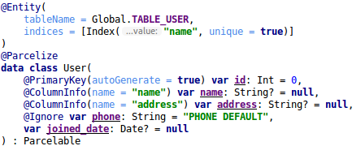

	+ annotation *@PrimaryKey(autoGenerate = true)*: chỉ ra đây là khóa chính và sẽ tự động tăng.
	+ Mặc định, Room sử dụng tên các trường làm tên cột, nếu muốn đặt tên cột khác ta sử dụng annotation *@ColumnInfo*
	+ Khi class được chú thích là @Entity thì tên của bảng sẽ là tên của class, nếu muốn đặt tên bảng khác ta có thể thêm thuộc tính *tableName* trong @Entity
	+ @Ignore: Trường có annotation này sẽ không được lưu vào database.
	+ indices: Sử dụng nếu bạn muốn đánh dấu trường trong database để tăng tốc độ truy vấn.
	+ unique: Sử dụng nếu bạn muốn trường đó là duy nhất trong DB (không trùng nhau)
	+ @Embedded: Sử dụng trong trường hợp bạn tạo ra 1 Object với các nested object, không muốn lưu chúng thành một bảng riêng mà đơn giản chỉ giống như 1 column bình thường.

#### DAOs (Data Access Object)
- Được chú thích bằng anotation *@Dao*, đây là thành phần chính của Room chịu trách nhiệm trong việc định nghĩa các phương thức truy cập CSDL.
- Một *DAO* có thể được thể hiện như một *interface* hoặc *abstract*
- Khi code được sinh ra ở thời điểm compile-time thì Room sẽ tạo một implementation của class này.
- UserDao.kt

		
	
	+ Các hàm được chú thích bởi *@Insert*, *@Update*, *@Delete* nhận một instance của lớp cần thiết làm tham số, đại diện cho đối tượng mà chúng ta muốn muốn insert, update hoặc delete.
	+ Trong trường hợp *insert* or *update*, có thể sử dụng thuộc tính *onConflict* để cho biết phải làm gì khi xảy ra xung đột khi thực hiện thao tác. Các chiến lược có thể sử dụng như: REPLACE, ABORT, FAIL, IGNORE, ROLLBACK
	+ *@Query*: Lấy thông tin của một hoặc nhiều Entity.

#### Database
- Tạo database holder. Định nghĩa danh sách các DAO của CSDL.

	

	+ Được chú thích bởi @Database. Là một abstract class kế thừa từ RoomDatabase. Nó nhận vào một danh sách các thực thể với tất cả các lớp tạo CSDL (tất cả các lớp có chú thích @Entity)
	+ Chúng ta phải khai báo một hàm abstract cho mỗi Entity, hàm này phải trả về giá trị tương ứng DAO (Lớp được chú thích là @Dao)

### Room với RxJava
- Điều có lẽ là tuyệt vời nhất của Room là nó sử dụng được sức mạnh của các thành phần trong *Architecture Components*. Các query không đồng bộ trả về *LiveData* hoặc RxJava như *Maybe*, *Single*, *Flowable* và có thể quan sát được. Điều này đảm bảo UI luôn tự đọng cập nhật mới nhất và khớp với Database.

- Insert:
	+ Completable: Được gọi khi quá trình insert được thực hiện. Trả về một onComplete hoặc Error
	+ Single<Long> or Maybe<Long>: Giá trị được phát ra là id của hàng được thêm hoặc Error
	+ Single<List<Long>> or Maybe<List<Long>>: Giá trị phát ra là một danh sách các id của hàng được thêm hoặc Error.

	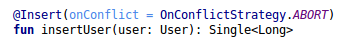

- Update/Delete:
	+ Complete: Trả về một onComplete hoặc Error
	+ Sigle<Interger> or Maybe<Integer>: Giá trị phát ra là số lượng hàng bị ảnh hưởng bởi query.

	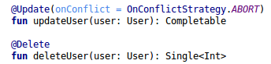

- Query:
	+ Maybe: 
		+ Khi database rỗng và query không trả về hàng nào sẽ chạy vào complete. 
		+ Khi database có dữ liệu, dữ liệu được phát ra trong onSuccess và sau đó complete
		+ Khi dữ liệu updated sau khi Maybe complete, sẽ không có gì xảy ra.
	+ Single:
		+ Khi database rỗng và query không trả về row nào, Single sẽ trả về onError()
		+ Khi database có dữ liệu, Single sẽ trả về onSuccess()
		+ Nếu dữ liệu updated sau khi Single hoàn thành, sẽ không có gì xảy ra.
	+ Flowable:
		+ Khi database rỗng và query không trả về row nào, Flowable không phát ra item, không gọi onNext(), không gọi onError().
		+ Khi database có dữ liệu, Flowable sẽ trả về trong onNext()
		+ Khi dữ liệu updated, Flowable tự động phát ra, cho phép cập nhật UI với dữ liệu mới nhất.

	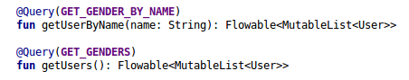

### Migration với Room
- Với Room, nếu bạn thay đổi lược đồ CSDL nhưng không nâng cấp version, ứng dụng sẽ bị crash. Nếu bạn nâng cấp version nhưng không cung cấp bất cứ *migration* thì app sẽ bị crash hoặc các bảng CSDL sẽ bị hủy và mất dữ liệu người dùng.
- Room cho phép chúng ta viết lớp *Migration* để bảo vệ dữ liệu người dùng
- Room cung cấp một lớp trừu tượng *Migration* để dễ dàng chuyển đổi SQLite. Lớp *Migration* định nghĩa các hành động cần được thực hiện khi chuyển đổi từ version cũ sang version mới.
- Một thành phần quan trọng trong migration là *identity hash*, chuỗi này được Room sử dụng để xác định duy nhất cho mọi database version.

- Các trường hợp có thể xảy ra khi thay đổi CSDL:
- Giữ nguyên database version -> App crashes
	+ Room sẽ check định danh của database bằng cách so sánh *identity hash* của version hiện tại với version được lưu trong *room_master_table*. Nhưng vì không có *identity hash* nào được lưu dẫn đến crash (IllegalStateException).
- Tăng version nhưng không cung cấp *migration* -> App crashes
	+ Khi chạy lại app, Room sẽ làm như sau: Thử nâng cấp version, nhưng vì không có *migration*, app bị crash với *IllegalStateException*
- Tăng version, Enable fallbackToDestructiveMigration() -> database bị xóa.
	+ Room thử nâng cấp version, bảng bị xóa và *identity_hash* được chèn.
	+ Room mở CSDL: *identity_hash* của version hiện tại và version được lưu là giống nhau.
- Tăng version, cung cấp *Migration* -> Dữ liệu được toàn vẹn.
	+ Room nâng cấp version: kích hoạt *migration* và cập nhật *identity hash* trong room_master_table
	+ Room mở database
	+ Nếu lược đồ CSDL không thay đổi, chỉ cần cung cấp một *empty migration* để Room sử dụng.

#### Migration với các thay đổi lược đồ đơn giản.
- Ví dụ: Thêm 1 trường vào bảng User.
- Trong Database cần làm những công việc sau:
	+ Tăng version lên 1
	+ Add 1 Migration từ version cũ lên mới
	+ Add *Migration* vào Room database builder

	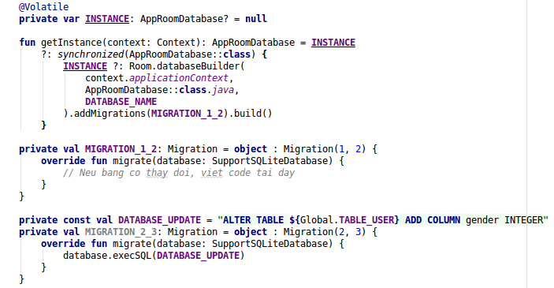

	+ Quá trình xử lý: Update version, kích hoạt migration, lưu giữ lại data người dùng, cập nhật *identity hash* vào bảng room_master_table.

#### Migration với các thay đổi phức tạp
- SQLite "ALTER TABLE..." có một số hạn chế, ví dụ như thay đổi id của User từ  Int sang String. Các bước xử lý sẽ là:
	+ Tạo một bảng tạm thời mới với lược đồ mới
	+ Sao chép dữ liệu từ bảng cũ sang bảng tạm thời
	+ Xóa bỏ bảng cũ
	+ Đổi lại tên của bảng tạm thời thành tên như bảng cũ

	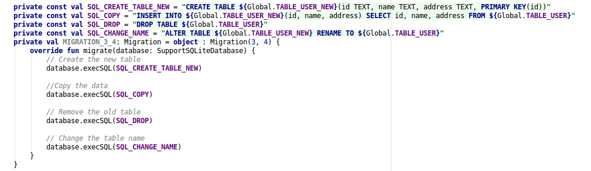

#### Multiple database version increments
- Giả sử bạn đang ở version 1 và muốn update lên version 4. Room có thể migration từ version 1 lên version 4 trong 1 bước

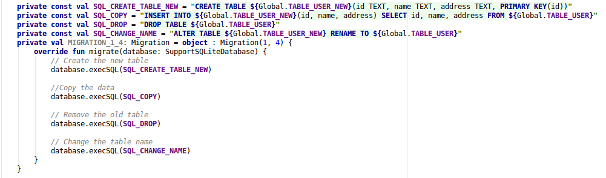

### Room và Time
- Khi lưu trữ dữ liệu, đôi khi bạn cần lưu trữ và truy xuất ngày, giờ. Nhưng Room không cung cấp bất kỳ sự hỗ trợ nào cho điều đó, thay vào đó, nó cung cấp annotation @TypeConverter, cho phép ánh xạ các đối tượng tùy ý cho Room hiểu và ngược lại. Ví dụ:
	+ Entity: Sử dụng lớp Date

	

	+  TypeConverter

	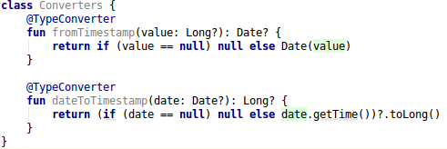

	+ Cấu hình @TypeConverter trong database
	
	

	+ Kết quả:
	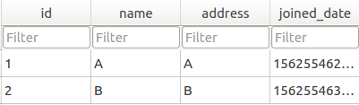

## Tài liệu tham khảo
- SQLite:
- Room:
	+ https://developer.android.com/training/data-storage/room/index.html
	+ https://medium.com/mindorks/room-kotlin-android-architecture-components-71cad5a1bb35
	+ Google Sample: https://github.com/googlesamples/android-architecture-components
	+ Room + Rx: https://medium.com/androiddevelopers/room-rxjava-acb0cd4f3757
	+ Room + Time: https://medium.com/androiddevelopers/room-time-2b4cf9672b98
